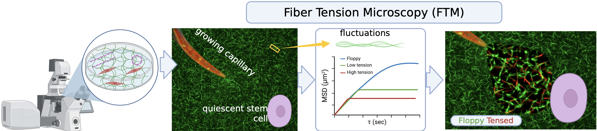

# Fiber Tension Microscopy (FTM)

> **Measure internal tension of individual ECM fibers from confocal line scans, and paint full fields-of-view by tension.**  
> MATLAB reference implementation + analysis utilities.

<div align="center">
  
</div>

---

## Table of Contents
- [Overview](#overview)
- [Repository Structure](#repository-structure)
- [Installation](#installation)
- [Quick Start](#quick-start)
- [Workflow](#workflow)
- [Theory (Short Version)](#theory-short-version)
- [Figures](#figures)
- [Objective](#Objective)
- [Significance](#significance)
- [Citing](#citing)
- [License](#license)
- [Acknowledgments](#acknowledgments)

---

## Overview

**Fiber Tension Microscopy (FTM)** is a hardware + computational framework to quantify **tension within individual fibers** of a fibrous extracellular matrix (ECM) using any commercial **laser scanning confocal microscope**. The code here:
- tracks **sub-diffraction centroid fluctuations** of fibers from **rapid line scans**,
- converts the **mean squared displacement (MSD)** of fiber midpoints to a **dimensionless tension** \\( \phi \\) via an odd-mode sum model for semiflexible filaments,
- returns **physical tension** \\( \tau \\) (pN), and
- **paints** full images by stiffness/tension classification for visualization.

---

## Repository Structure

```
FTM/
├─ analyze_fiber_fluctuations.m   % line-scan → centroids → histograms (std dev)
├─ paint_fibers.m                 % paint stiff vs. floppy regions from coordinates
├─ compute_fiber_tension.m        % invert MSD → φ → τ (pN)
├─ assets/
│   ├─ overview.png
│   └─ example_results.png
└─ README.md
```

> **Requirements**
> - MATLAB R2019b+ (R2020b+ recommended)
> - Curve Fitting Toolbox (Gaussian fits)
> - [Bio-Formats for MATLAB (`bfopen`)](https://www.mathworks.com/matlabcentral/fileexchange/129249-bioformats-image-toolbox) to read `.oir` files

---

## Installation

1. Install MATLAB (with Curve Fitting Toolbox).
2. Install the **Bio-Formats Image Toolbox** and add it to your MATLAB path (for `.oir` support).
3. Clone this repository and add it to your MATLAB path:
   ```matlab
   addpath(genpath('/path/to/FTM'));
   ```

---

## Quick Start

### 1) Line-scan analysis → centroids (std devs)
```matlab
out = analyze_fiber_fluctuations(struct( ...
  'dataDir',        'path/to/line/scans', ...
  'pix2um',         1/38.6175, ...     % µm per pixel
  'downsample',     10, ...
  'roiHalfWidthPx', 13, ...
  'gofThreshold',   0.80, ...
  'showExample',    true, ...
  'savePrefix',     'session1' ...
));
```

### 2) Field painting (stiff vs. floppy)
```matlab
outPaint = paint_fibers(struct( ...
  'imageFile',  'colormap_fibers/T2_5.tif', ...
  'coordsXlsx', 'Line Scan Cords-2.xlsx', ...
  'matPath',    'matrix_to_paint_fibers.mat', ... % contains logical stiff/floppy vectors
  'indexRange', [133 143], ...
  'squareSize', 50, ...
  'shape',      'square', ... % or 'disk'
  'outDir',     'outputs', ...
  'savePrefix', 'T2_5' ...
));
```

### 3) MSD → tension (table in/out)
```matlab
Tout = compute_fiber_tension(struct( ...
  'xlsxPath','CrossLinkedFibers_Tension_far.xlsx', ...
  'outputPath','Fiber_Tension_Output.xlsx' ...
));
```

---

## Workflow

1. **Acquire** rapid line scans over visible fibers (≥600–800 lines/s).  
2. **Track centroids** via Gaussian fits per line → time series of midpoint position.  
3. **Compute MSD** at the midpoint and invert the semiflexible filament model (odd-mode sum) to get \\( \phi \\) and **tension** \\( \tau \\).  
4. **Paint** the field: classify or color-code fibers as *floppy/low/high* tension.  
5. **Export** tables, figures, and overlays for downstream analysis.

---

## Theory (Short Version)

For a semiflexible filament with persistence length \\( \ell_p \\) and length \\( L \\), the **midpoint MSD** obeys
\\[
\\mathrm{MSD} = \\frac{2}{\\pi^4}\\,\\frac{L^3}{\\ell_p}\\, S(\\phi), \\quad
S(\\phi) = \\sum_{n\\,\\text{odd}} \\frac{1}{n^4 + \\phi n^2}, \\quad
\\phi = \\frac{\\tau L^2}{\\kappa},\\; \\kappa = \\ell_p k_B T.
\\]
Given \\(L\\) and measured MSD, we solve for \\( \\phi \\) by **bracketed bisection** and then compute **tension**  
\\( \\tau = (\\phi\\, \\pi^2\\, \\kappa)/L^2 \\). Feasibility is checked against the **zero-tension ceiling** \\( \\mathrm{MSD}_{\\max} = L^3/(48\\ell_p) \\).

---

## Figures

<div align="center">
  
</div>

---


## Objective

Cells remodel the fibrous ECM via contractile forces, enabling **long-range mechanical communication** that coordinates tissue-scale processes (organization, morphogenesis, and disease progression). We hypothesize that **mechanical signals are transmitted before fiber realignment is detectable**, i.e., **Early Mechanotransduction**. We will build **Fiber Tension Microscopy (FTM)**—a confocal-compatible hardware/software toolkit—to **measure per-fiber tension** at scale.

## Significance

Mechanical communication in **fibrous** ECMs (e.g., fibrin, collagen) is **directional, long-range, and functional**. Existing traction/stress methods in **amorphous** gels do not measure **internal fiber tension**. FTM fills this gap with a non-invasive, confocal-based approach to quantify per-fiber tension and generate **tension maps** that co-register with standard fluorescence imaging.


## Citing

If you use FTM or parts of this work in your research, please cite:

> **Eldeen, S., Bruinsma, R., Botvinick, E.L., et al.** *Fiber Tension Microscopy (FTM): Quantifying Force Transmission Pathways in Fibrous Extracellular Matrices.* (preprint/in preparation).

---

## License

MIT License — see `LICENSE` (or update per your lab policy).

---

## Acknowledgments

Thanks to collaborators and advisors including Robijn Bruinsma, Elliot Botvinick, the late Alex Levin, Enrico Gratton, and colleagues who contributed to theory and imaging.

